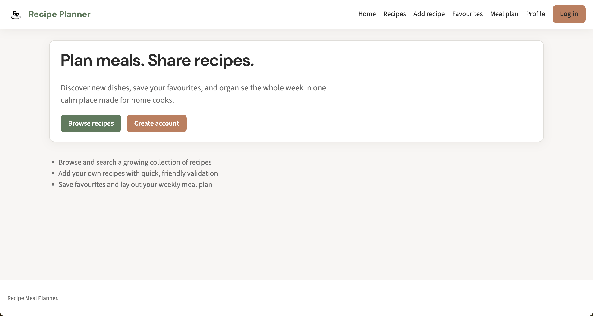
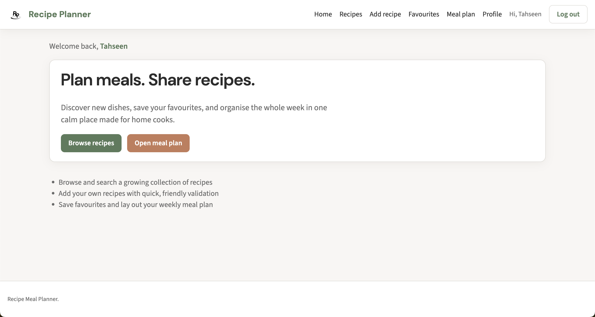
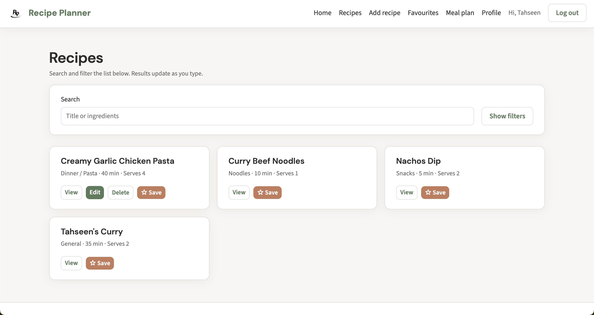
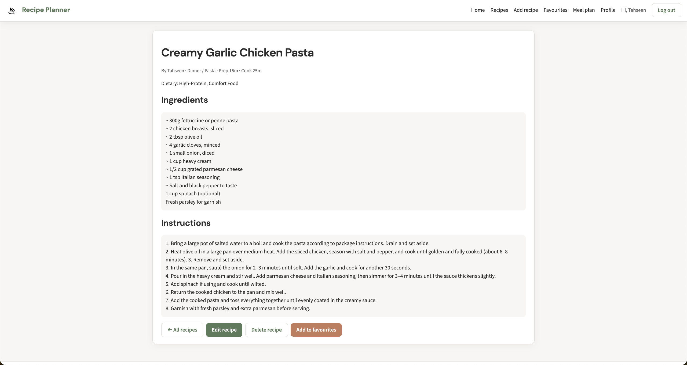
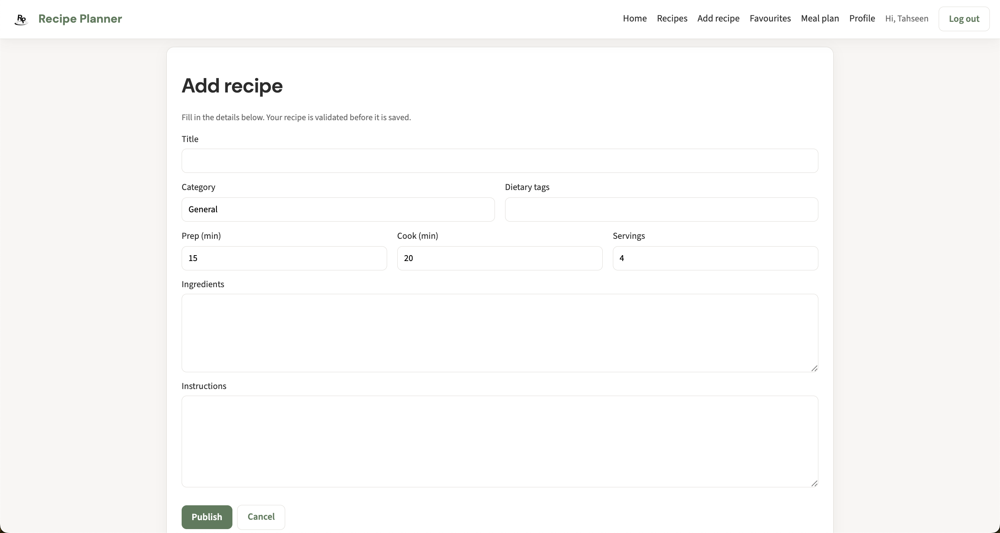
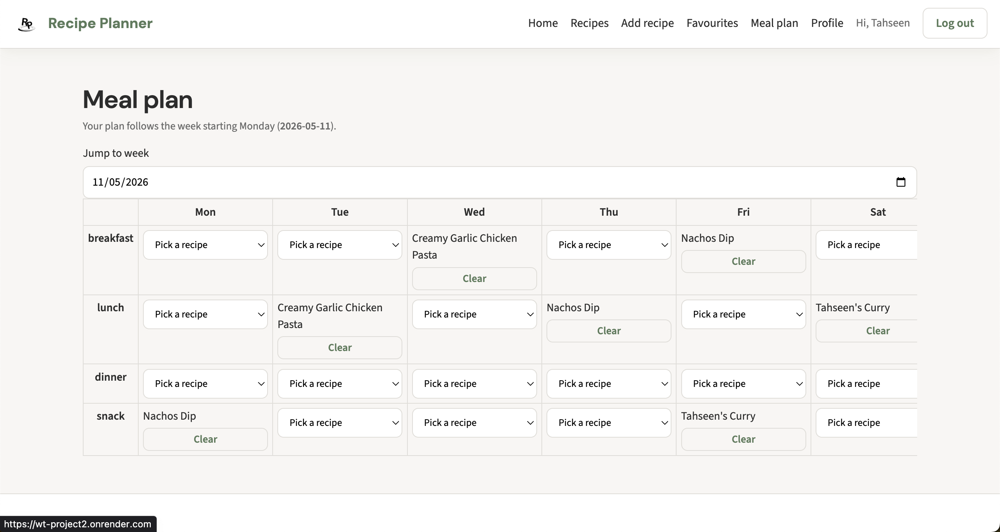
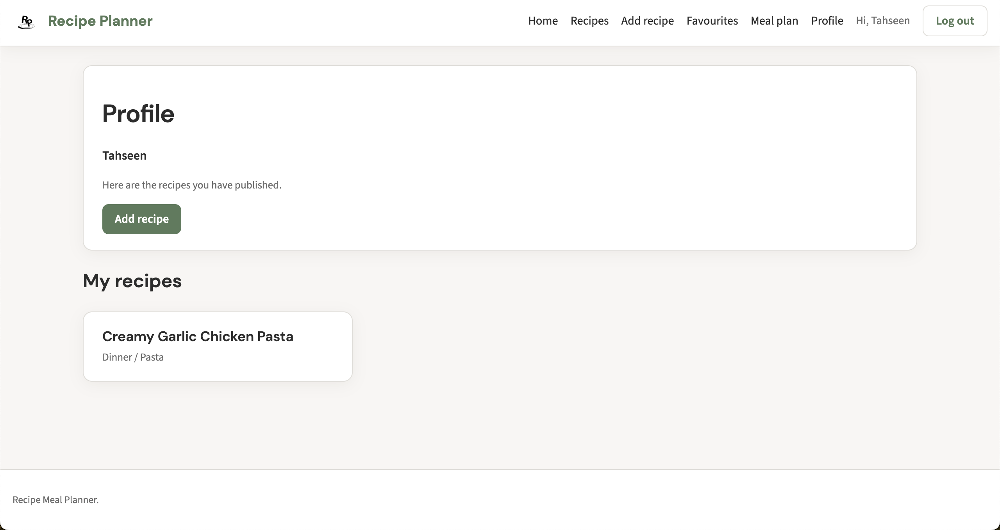

# Recipe Meal Planner

A full-stack web application for browsing recipes, saving favourites, planning weekly meals, and managing your own recipes with secure session-based authentication. It pairs a **React (Vite)** single-page app with an **Express** REST API and **MongoDB** persistence.

This repository was built for a **college Web Technologies coursework group project**.

---

## Live Demo

- **Live Site:** https://wt-project2.onrender.com/
- **Health Check:** https://wt-project2.onrender.com/health

---

## Screenshots

<p align="center">
  
</p>

<p align="center"><em>Landing page with login and registration</em></p>

<p align="center">
  
</p>

<p align="center"><em>Personalized home page for returning users</em></p>

<p align="center">
  
</p>

<p align="center"><em>Browse recipes, manage favourites, and edit your own recipes</em></p>

<p align="center">
  
</p>

<p align="center"><em>Detailed recipe view with ingredients and cooking instructions</em></p>

<p align="center">
  
</p>

<p align="center"><em>Create and publish your own recipes</em></p>

<p align="center">
  
</p>

<p align="center"><em>Weekly meal planner for organizing meals</em></p>

<p align="center">
  
</p>

<p align="center"><em>User profile with authored recipes and saved favourites</em></p>

---

## Tech stack

| Layer | Technology |
|--------|------------|
| Frontend | React 19, React Router 7, Vite 8, plain CSS (design tokens in `index.css`) |
| Backend | Node.js 18+, Express 4, Mongoose 8 |
| Database | MongoDB (Atlas or local) |
| Auth | Session cookies (`express-session`), sessions stored in MongoDB (`connect-mongo`), passwords hashed with `bcryptjs` |
| Optional legacy UI | Server-rendered EJS views when the React build is not present (development fallback) |

---

## Project structure

```
WT_Project2/
├── client/                          # React SPA (Vite)
│   ├── public/
│   ├── src/
│   │   ├── api/                     # `apiFetch` helper (credentials, JSON)
│   │   ├── components/              # Layout, Navbar, ConfirmDialog, …
│   │   ├── context/                 # AppDataContext (session, recipes, favourites, meal plan)
│   │   ├── pages/                   # Route-level screens (Home, Auth, Recipes, …)
│   │   ├── utils/                   # Client validation, week helpers, recipe shape
│   │   ├── mocks/                   # Optional local mock data (dev / demos)
│   │   ├── App.jsx                  # Routes
│   │   ├── main.jsx
│   │   ├── App.css
│   │   └── index.css                # Global styles and theme variables
│   ├── index.html
│   ├── vite.config.js               # Dev proxy: `/api` → backend origin
│   ├── package.json
│   └── .env.example                 # Copy to `.env` for local client env vars
│
├── server/                          # Express API + optional EJS + static SPA
│   ├── src/
│   │   ├── config/                  # MongoDB connection
│   │   ├── middleware/              # e.g. `requireAuth`
│   │   ├── models/                  # Mongoose: User, Recipe, Favourite, MealPlanEntry
│   │   ├── routes/
│   │   │   ├── api.js               # JSON REST under `/api/*`
│   │   │   └── web.js               # Classic server-rendered routes (no SPA build)
│   │   ├── utils/                   # Validation, week helpers
│   │   └── app.js                   # Express app factory (sessions, `/api`, static `client/dist`)
│   ├── views/                       # EJS templates (fallback when `client/dist` missing)
│   ├── server.js                    # Entry: connect DB, listen on PORT
│   ├── package.json
│   └── .env.example                 # Copy to `.env` for server secrets and Mongo URI
│
└── render.yaml                      # Example Render.com deploy config (build + start)
```

**Runtime behaviour:** If `client/dist/index.html` exists after `npm run build` in `client/`, the server serves the React app and the API on the **same port**. If not, it falls back to the EJS-based `web` routes for local experimentation without a frontend build.

---

## Prerequisites

- **Node.js** ≥ 18  
- **npm**  
- **MongoDB** running locally, or a **MongoDB Atlas** cluster and connection string  

---

## Environment variables

### Server (`server/.env`)

Copy from `server/.env.example` and adjust:

| Variable | Purpose |
|----------|---------|
| `MONGODB_URI` | MongoDB connection string (required) |
| `SESSION_SECRET` | Secret used to sign session cookies (use a long random string in production) |
| `PORT` | HTTP port (default `3000` if unset) |

### Client (`client/.env`)

Copy from `client/.env.example`. Used mainly for optional absolute URLs in the bundle; for local development with Vite, defaults pointing at `http://localhost:3000` are typical.

---

## How to run locally

### 1. Install dependencies

From the repository root, install **both** packages:

```bash
cd server && npm install
cd ../client && npm install
```

### 2. Start MongoDB

Use your local `mongod` / MongoDB service, or ensure Atlas network access and credentials are correct.

### 3. Option A: Development (recommended): API + Vite dev server

**Terminal 1: backend**

```bash
cd server
npm start
# or: npm run dev   # auto-restarts on file changes
```

Server listens on **http://localhost:3000** (or your `PORT`). Health check: **http://localhost:3000/health**

**Terminal 2: frontend**

```bash
cd client
npm run dev
```

Open the URL Vite prints (usually **http://localhost:5173**). The dev server **proxies** requests to `/api/*` to the backend, so the React app and API work together without CORS issues.

---

### 3. Option B: Single port (production-style)

Build the client, then run only the server. Both the SPA and `/api` are served from one origin.

```bash
cd client
npm run build

cd ../server
npm start
```

Open **http://localhost:3000**. After **any** change under `client/src`, run `npm run build` again in `client/` and refresh the browser.

---

## Deployment (example)

`render.yaml` describes a possible **Render** deployment: install client, build static assets, install server, start with `npm start` in `server/`. Set `MONGODB_URI`, `SESSION_SECRET`, and any client-related env vars in the host’s dashboard.

---

## Features (overview)

- User registration and login with **session cookies**  
- Recipe listing, search/filter, detail view  
- Create, edit, and delete **your own** recipes  
- **Favourites**  
- **Weekly meal plan** (week anchored to Monday)  
- Profile view filtered to recipes you authored  

---

## Scripts reference

| Location | Command | Purpose |
|----------|---------|---------|
| `server/` | `npm start` | Run API (and SPA if `client/dist` exists) |
| `server/` | `npm run dev` | Same as start with Node `--watch` |
| `client/` | `npm run dev` | Vite dev server with hot reload |
| `client/` | `npm run build` | Production bundle → `client/dist` |
| `client/` | `npm run lint` | ESLint |

---

## License and attribution

This project was developed **for educational purposes only**, as part of a **college group assignment** in Web Technologies (WT). It is **not** intended for commercial distribution.

The `package.json` files may list `UNLICENSED`; that reflects the coursework context rather than an open-source license grant.

**Group members**

1. *Han Lee*
2. *Tahseen Ahmed*
3. *Mohamed fadel bucharaya el manssouri*  

If you reuse any code from this repository elsewhere, retain appropriate attribution and comply with your institution’s academic integrity rules.

---

## Troubleshooting

| Issue | What to try |
|-------|-------------|
| `MONGODB_URI is not set` | Ensure `server/.env` exists and contains a valid URI; start the server from `server/`. |
| Blank or stale UI on port 3000 | Run `npm run build` in `client/` after frontend changes. |
| API errors in the browser | Confirm the server is running and MongoDB is reachable. |
| Session not sticking | In production, HTTPS and cookie `secure` settings matter; locally, use `http://localhost` as documented. |

---

*Last updated for coursework submission.*
